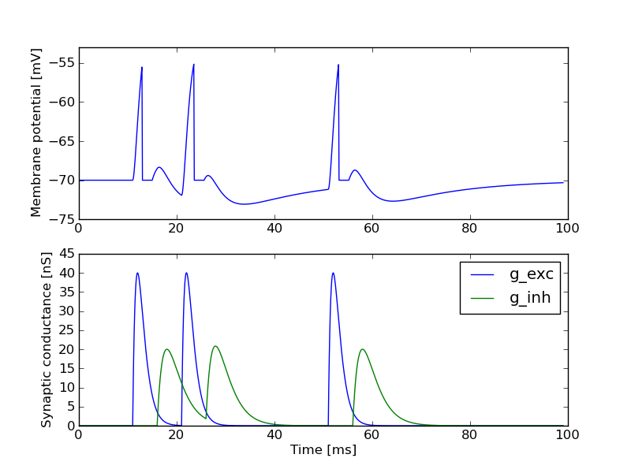

Analog recording with multimeter
================================

As of r89xx, NEST replaces a range of analog recording devices, such as
voltmeter, conductancemeter and aeif\_w\_meter with a universal *multimeter*,
which can record all analog quantities a model neuron makes available for
recording.
Multimeter works essentially as the old-style voltmeter, but with a few changes:

-   The `/recordables` list of a neuron model will tell you which quantities
    can be recorded:

        In [3]: nest.GetDefaults('iaf_cond_alpha')['recordables']
        Out[3]: ['V_m', 'g_ex', 'g_in', 't_ref_remaining']

-   You have to configure multimeter to record from a set of quantities:

        nest.Create('multimeter', params={'record_from': ['V_m', 'g_ex']})

-   By default, the recording interval is 1ms, but you can change this

        nest.Create('multimeter', params={'record_from': ['V_m', 'g_ex'], 'interval' :0.1})

-   The set of variables to record and the recording interval must be set
    **before** the multimeter is connected to any node, and cannot be changed
    afterwards.

-   After one has simulated a little, the `events` entry of the multimeter
    status dictionary will contain one numpy array of data for each recordable.

-   Any node can only be recorded from by one multimeter.

Adapting scripts using voltmeter
--------------------------------

Many NEST users have scripts that use voltmeter to record membrane potential.
To ease the transition to the new-style analog recording, NEST still provides a
device called `voltmeter`. It is simply a multimeter pre-configured to record
the membrane potential `V_m`. It can be used exactly as the old voltmeter.
The only change you need to make to your scripts is that you collect data from
events/V\_m instead of from events/potentials, e.g.

    In [24]: nest.GetStatus(m, 'events')[0]['V_m']

    Out[24]:
    array([-70.        , -70.        , -70.        , -70.        ,
           -70.        , -70.        , -70.        , -70.        ,

An example
----------

As an example, here is the multimeter.py example from the PyNEST examples set:

    import nest
    import numpy as np
    import pylab as pl

    # display recordables for illustration
    print 'iaf_cond_alpha recordables: ', nest.GetDefaults('iaf_cond_alpha')['recordables']

    # create neuron and multimeter
    n = nest.Create('iaf_cond_alpha',  params = {'tau_syn_ex': 1.0, 'V_reset': -70.0})

    m = nest.Create('multimeter', params = {'withtime': True, 'interval': 0.1, 'record_from': ['V_m', 'g_ex', 'g_in']})

    # Create spike generators and connect
    gex = nest.Create('spike_generator', params = {'spike_times': np.array([10.0, 20.0, 50.0])})
    gin = nest.Create('spike_generator',  params = {'spike_times': np.array([15.0, 25.0, 55.0])})

    nest.Connect(gex, n, params={'weight':  40.0}) # excitatory
    nest.Connect(gin, n, params={'weight': -20.0}) # inhibitory
    nest.Connect(m, n)

    # simulate
    nest.Simulate(100)

    # obtain and display data
    events = nest.GetStatus(m)[0]['events']
    t = events['times'];

    pl.subplot(211)
    pl.plot(t, events['V_m'])
    pl.axis([0, 100, -75, -53])
    pl.ylabel('Membrane potential [mV]')

    pl.subplot(212)
    pl.plot(t, events['g_ex'], t, events['g_in'])
    pl.axis([0, 100, 0, 45])
    pl.xlabel('Time [ms]')
    pl.ylabel('Synaptic conductance [nS]')
    pl.legend(('g_exc', 'g_inh'))

Here is the result:

