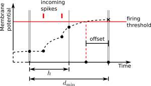

Simulations with precise spike times
====================================

The simulation resolution *h* and the minimum synaptic transmission delay
*dmin* define the two major time intervals of the [scheduling and simulation flow of NEST](../scheduling-and-simulation-flow/index.html):
neurons update their state variables in steps of *h*, whereas spikes are
communicated and delivered to their targets in steps of *dmin*,
where *dmin* is a multiple of *h*.

Traditionally, spikes are constrained to the simulation grid such that neurons
can propagate their state variables for an entire *h*-step without interruption
by incoming spikes. This enables faster simulations of neurons with linear
sub-threshold dynamics as a precomputed propagator matrix for a time step of
fixed size *h* can be employed ([Rotter & Diesmann, 1999](http://dx.doi.org/10.1007/s004220050570)).

Neurons buffer the incoming spikes until they become due, where spikes can be
lumped together provided that the corresponding synapses have the same
post-synaptic dynamics. Within a *dmin*-interval, each neuron
independently proceeds in steps of *h*: it retrieves the inputs that are due in
the current time step from its spike buffers and updates its state variables
such as the membrane potential.

Propagation of membrane potential in case of grid-constrained spiking. Filled
dots indicate update of membrane potential; black cross indicates detection of
threshold crossing. As visual guidance, dashed black curves indicate time course
of membrane potential. For simplicity, dmin=2h.

If after an update the membrane potential is above the firing threshold, the
neuron emits a spike and resets its membrane potential. Due to time
discretization both spike and reset happen at the right border of the *h*-step
in which the threshold crossing occurred; the spike is time stamped accordingly.

NEST enables also simulations with precise spike times, which are represented by
an integer time stamp and a double precision offset. As the incoming spikes
divide the *h*-steps into substeps, a neuron needs to update its state variables
for each substep.

Propagation of membrane potential in case of off-grid spiking. Dashed red line
indicates precise time of threshold crossing.

If after an update the membrane potential is above the firing threshold, the
neuron determines the precise offset of the outgoing spike with respect to the
next point on the time grid. This grid point marks the spike's time stamp. The
neuron then emits the spike and resets its membrane potential.

Models with precise spike times in NEST
---------------------------------------

`poisson_generator_ps` creates Poissonian spike trains, where spike times have
an integer time stamp and a double precision offset. It is hence dedicated to
simulations with precise spike times. The device can also be connected to
grid-constrained neuron models, which only use the time stamps of the spikes and
ignore their offsets. However, spike generation with `poisson_generator_ps` is
less efficient than with its grid-constrained counterpart `poisson_generator`.

`parrot_neuron_ps` repeats the incoming spikes just as its grid-constrained
counterpart `parrot_neuron` but it is able to represent precise spike times.

`iaf_psc_delta_canon` is an integrate-and-fire neuron model with delta-shaped
post-synaptic currents that employs precise spike times; its grid-constrained
counterpart is `iaf_psc_delta`. In this model the precise location of an
outgoing spike is determined analytically.

`iaf_psc_alpha_canon` and `iaf_psc_alpha_presc` are integrate-and-fire neuron
models with alpha-shaped post-synaptic currents that employ precise spike times;
their grid-constrained counterpart is `iaf_psc_alpha`. The neuron models have
been developed in the context of [Morrison et al. (2007)](http://dx.doi.org/10.1162/neco.2007.19.1.47).
As both models employ interpolation in order to determine the precise location
of an outgoing spike, the achieved precision depends on the simulation
resolution *h*. The models differ in the way they process incoming spikes,
which also affects the attained precision (see [Morrison et al. (2007)](http://dx.doi.org/10.1162/neco.2007.19.1.47)
for details).

`iaf_psc_exp_ps` is an integrate-and-fire neuron model with exponentially shaped
post-synaptic currents that employs precise spike times; its grid-constrained
counterpart is `iaf_psc_exp`. It has been developed in the context of
[Hanuschkin et al. (2010)](http://dx.doi.org/10.3389/fninf.2010.00113),
which is a continuation of the work presented in [Morrison et al. (2007)](http://dx.doi.org/10.1162/neco.2007.19.1.47).
As the neuron model employs an iterative search in order to determine the
precise location of an outgoing spike, the achieved precision does not depend on
the simulation resolution h. The model can also be used through the [PyNN interface](http://neuralensemble.org/trac/PyNN/wiki/ContinuousTimeSpiking).

The source code of these models is in the [*precise* module of NEST](https://github.com/nest/nest-simulator/tree/master/precise).

Questions and answers about precise neurons
-------------------------------------------

During the review process of the above mentioned papers, we came up with a list
of questions and answers pertaining to the implementation and usage of precise
spiking neurons. This list can be found [here](../qa-precise-spike-times/index.html).
